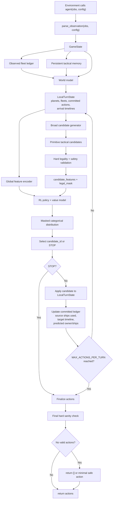
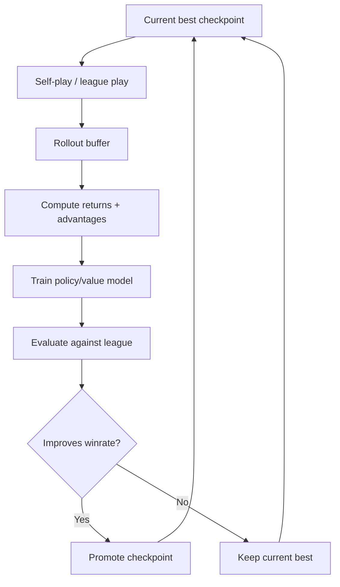

# Orbit Wars RL Pipeline

Muc tieu: toi uu ket qua bang RL, khong bi khoa trong policy heuristic hien tai. Heuristic chi duoc giu lai o vai tro an toan va geometry, khong phai nguon quyet dinh chinh.

## 1. Nguyen tac thiet ke

- Policy RL khong output raw action lien tuc `(angle, ships)` truc tiep.
- Policy RL chon tren tap candidate hop le co mask.
- Candidate generator phai rong, khong phai la heuristic offense/defense chon san.
- Sau moi action duoc chon trong cung turn, phai apply vao local state de lan chon tiep theo thay duoc action da commit.
- Moi quyet dinh attack/defense phai dua tren arrival timeline, khong chi dua tren snapshot ships hien tai.
- Fallback heuristic chi la safety fallback toi thieu, khong nen la policy chinh.

## 2. Runtime pipeline



## 3. Core runtime components

### 3.1 Parser

Input:
- raw `obs`
- raw `config`

Output:
- normalized `GameState`

Responsibilities:
- Normalize planet/fleet fields.
- Preserve raw extras when useful.
- Detect moving planets/comets only as metadata, not as policy decisions.

### 3.2 World model

Input:
- `GameState`
- observed fleets
- persistent memory

Output:
- `LocalTurnState`

Responsibilities:
- Build fleet arrival ledger from observed fleets.
- Infer fleet target when target id is absent.
- Predict target owner/ships at future ticks.
- Track committed actions selected by RL within the current turn.
- Prevent repeated attacks into already-winning target timelines.

### 3.3 LocalTurnState

Must contain:
- current planets
- current fleets
- source ships already committed this turn
- attack arrivals by target
- defense arrivals by target
- predicted planet timeline by target
- candidate rejection reasons for debugging

This is the most important layer. Without it, RL will make sequential decisions on stale state.

### 3.4 Candidate generator

This should generate broad options, not final heuristic moves.

Candidate types:
- `STOP`
- `ATTACK`
- `EXPAND_NEUTRAL`
- `REINFORCE`
- `DEFEND`
- `HARASS`
- `HOLD_SOURCE`

Candidate parameters:
- source planet id
- target planet id
- ships
- angle
- eta
- tactical type
- estimated outcome

Allowed reuse from old heuristic:
- intercept solver
- fleet ETA estimation
- sun safety check
- action legality constraints

Do not reuse as final decision:
- old offense target ranking as policy
- old defense planner as policy
- old memory-only en-route shortcut

### 3.5 Safety and legality layer

Hard constraints:
- source exists and is owned by player
- source has enough uncommitted ships
- ships > 0
- angle is finite
- ETA is valid
- launch path does not cross sun
- target is meaningful
- action format is valid for environment

This layer can mask candidates, but it must not choose strategy.

### 3.6 RL model

Recommended interface:

```text
policy(global_features, candidate_features, candidate_mask)
    -> logits over candidates
    -> value estimate
```

The model selects one candidate at a time. After each selected candidate, the candidate set is regenerated from updated `LocalTurnState`.

Model outputs:
- masked logits
- value head
- optional auxiliary heads:
  - win probability
  - expected production swing
  - expected ships swing

## 4. Candidate feature design

Global features:
- normalized step
- player id
- planet count by owner
- production by owner
- ships on planets by owner
- ships in fleets by owner
- current score-like advantage
- phase indicators learned or hand-derived

Per-planet features:
- owner encoding
- ships
- production
- radius
- x/y
- moving flag
- comet flag
- incoming friendly ships by ETA buckets
- incoming enemy ships by ETA buckets

Per-candidate features:
- type encoding
- source ships available
- ships sent
- target owner
- target ships now
- target production
- ETA
- distance
- projected target owner after action
- projected target ships after action
- overkill amount
- underkill amount
- source reserve after action
- sun-safe flag
- number of friendly arrivals already committed to target

## 5. Sequential action selection

Pseudo flow:

```python
def rl_choose_actions(state, model, memory):
    local = build_local_turn_state(state, memory)
    actions = []

    for _ in range(MAX_ACTIONS_PER_TURN):
        global_features = encode_global(local)
        candidates = generate_candidates(local)
        candidates = validate_and_mask(local, candidates)

        if not any(c.legal for c in candidates):
            break

        candidate_id = model_select(model, global_features, candidates)
        candidate = candidates[candidate_id]

        if candidate.type == "STOP":
            break

        if not candidate.legal:
            local.reject(candidate, reason="illegal_model_choice")
            continue

        actions.append(candidate.to_action())
        local.apply(candidate)

    return final_sanity_check(actions, state)
```

The critical step is `local.apply(candidate)`. It updates:
- source ships used
- target arrival timeline
- predicted capture status
- future candidate masks

## 6. Training pipeline



Recommended algorithm:
- Start with PPO or IMPALA-style actor learner.
- Use masked categorical action distribution.
- Store candidate features and selected candidate id per decision step.
- Treat each selected candidate inside a turn as one policy decision.

## 7. Reward design

Primary terminal reward:
- `+1` win
- `-1` loss
- `0` draw if environment supports draw

Dense shaping should be light:
- production gained
- enemy production removed
- planet captured
- planet lost
- ships wasted into already-winning target
- ships lost to sun/invalid trajectory
- severe idle surplus penalty only when clearly bad

Avoid:
- huge reward for raw ships sent
- rewarding action count
- rewarding heuristic agreement
- too many hand-shaped tactical objectives

## 8. Evaluation

Must track:
- winrate vs baseline agents
- average production advantage
- average planet count advantage
- invalid action rate
- ships wasted into overkill
- repeated attack rate into already-winning targets
- runtime per turn

Promotion rule:
- promote only when new checkpoint beats current best by statistically meaningful margin across rotated seats and seeds.

## 9. Proposed file structure

```text
main.py
core/
  parser.py
  types.py
  geometry.py
  __init__.py
rl/
  agent.py
  candidates.py
  features.py
  local_state.py
  model.py
  rewards.py
  train.py
  evaluate.py
  checkpoint.py
tools/
  smoke_test.py
local-arena/
  arena.py
  watch.py
  match_stats.py
```

Old heuristic modules should not remain part of the final RL runtime unless they are reduced to reusable geometry/safety helpers.

## 10. Migration plan

Step 1:
- Keep parser/types/geometry.
- Remove old heuristic policy files from the active path.
- Create RL stubs for candidate generation, feature encoding, local state, and model wrapper.

Step 2:
- Implement `LocalTurnState` and arrival timeline.
- Add tests for repeated target attacks and source ship commitment.

Step 3:
- Implement broad candidate generator.
- Use random/masked policy first to validate legality.

Step 4:
- Add train/eval loop.
- Use PPO with masked categorical candidates.

Step 5:
- Add league evaluation and checkpoint promotion.

## 11. Non-negotiable correctness rules

- Never select a candidate from stale state after a previous candidate was committed.
- Never decide attack sufficiency with only total en-route ships; use arrival timeline.
- Never let fallback heuristic hide model failure during evaluation.
- Never train on one action interface and infer with a different one.
- Never keep old heuristic ranking as the main source of candidate choice.
